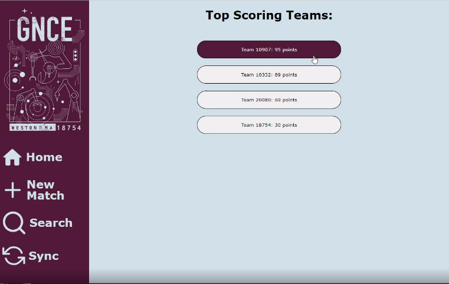

<h2 style = "text-align: center">Galactic Narwhal Chicken Effect: FTC Team 18754</h2>
 
<h2>About Scouting Program</h2>

In the 2022-2023 First Tech Challenge <em>Power Play</em> competition, my robotics team was lucky enought to make it to the World Finals. I was tasked with building a program to track games and visualize patterns, so our team could better strategize in our matches. This is what I created.

<h2>Technology</h2>

One of the problems I encountered was that we would not have WIFI access during the competitions, since it would disturb the robots. Because I am most familiar with web development, I circumvented this problem by packaging my app with Electron, and restricting WIFI features until a connection was established. I built the app with the Laravel PHP framework, which I was very experienced with. Though these choices might not be best, using a technology I knew well led to faster development.

<h2>App Flow</h2>

The home screen shows all teams ranked by their average score per game. This is helpful if we have to pick teammates, because we can quickly filter out all the lowest scoring teams, and get a rough idea of who the best is. You can also click on the buttons to view a profile of each team

 

The team info page combines all games together and creates a heatmap of cone placement. In this example dataset, we can see that Team 10332 places 15% of their cones on the high junction, and scatters the rest around that junction. They don't travel very far from their side, preferring to fight on their own turf. By looking at this data, we can gain insights into their strategy, possible synergies with us, and ways to defeat them.

 

To record a new match, enter in the team whose perspective you will be recording, which team they will be playing on, and who they will be playing against. The app will later use this information to look through the game and generate detailed statistics

 

The core of the program is as minimalistic as possible. There are buttons with hotkeys to specify what happened, and you click on a junction or terminal to tell where it happened. You can undo mistakes, and there is a rotate button in case you have a different view of the field, though it uses a normalized coordinate system from a singular reference frame. Finally, a timer shows how long has been spent in each mode.

 

After recording games, you can search them up to get more information. Games are sorted by most recent, and include information like opponents, score, and accuracy.

 

Match info pages show cone placement, sorted by auto, manual, and combined. While a team info page can show general strategy trends, these match info pages let you see exact breakdows of a team's placements. It easily lets you see how strong a team's Autonomous mode is, where they place their beacon, and junctions they cycle onto.

 

<h2>Technical Difficulties</h2>
<ul>
<li>For some reason, the program never worked correctly on mac; this ended up not being an issue, becuase we had enough windows computers.</li>
<li>I never quite got the server running bug free, because the project was discontinued before I finished it</li>
<li>I would later realize that there are public databases where tons of game information is available. I may reattempt this project in the future, and I will definitely use these APIs instead of manually recording data.
</ul>

<h2>What I Learned</h2>
Even though the project was never super successful, I took a lot away from the experience.
<ul>
<li>I became a much more proficient web developer, learning about database structure, server requests, and becoming much better with PHP and Laravel</li>
<li>I'll always remember to look for simple solutions before building up a product. If I had known about the public game info databases before I started, this project would have been much simpler and much more useful to my team/
<li>I gained confidence in my abilities and a strong work ethic
</ul>

